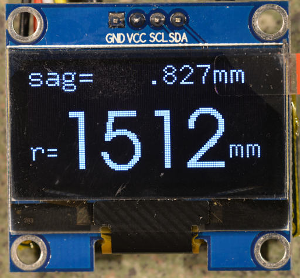
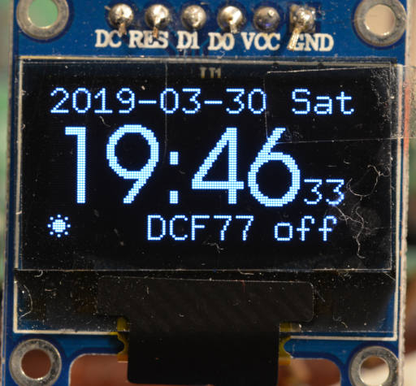

Putting BDF into the `.data` segment
====================================

(Note, this a somewhat hacky tool I use for personal projects; provided AS-IS).

Simple tool to generate bitmap-fonts to be compiled into static data C-structs
from BDF fonts, including support functions to access them.

The focus is to generate a somewhat compact representation of fonts suited
for embedded systems with little flash memory. In particular larger fonts
benefit a lot from this.

### Compaction

The compaction techniques are a balance between space-savings and easy
decoding (computation and code-size) in microcontrollers:

  * Allow to only include the subset of characters you need.
  * No fixed array sizes per Glyph which allows variable length encoding.
  * Empty space around a character is not stored.
  * Automatic per-Glyph selection of best encoding from a choice of direct
    data byte storage and two different run length encodings.
  * Choice of two run length encodings
    1) One byte storing repetition-counts in nibbles, followed by
       the bytes that should be repeated `[c1|c0] [b0] [b1]`.
       Larger fonts with longer repetitions of the same byte benefit from
       this encoding. `c0` is always non-zero; if `c1` is zero, `[b1]` is
       omitted.
    2) One byte storing counts in two bits followed by the bytes to
       be repeated: `[c3|c2|c1|c0] [b0] [b1] [b2] [b3]`.
       `c0` is always non-zero. The top counts can be zero; for each
       zero `cn`, the corresponding `[bn]` is omitted.

### Unicode

Fonts can have any Unicode characters from the Basic Multilingual Plane (the
first 16 bit), so it is easy to include special characters such as μ or π.
Because of the vast choice, you have to specify _which_ characters you'd like
to include into the compiled code to keep data compact. It is perfectly
ok to have 'sparse' fonts that only contain the characters you need for
your program strings.

### Build and use
```bash
make -C src
# Invoking tool. Multiple instances of same character is only included once.
src/bdfont-data-gen -c "01234567890μHelloWorld" path/to/font.bdf myfontname
```

Optionally install with
```
sudo make -C src install
```

#### Invocation Synopsis
```
usage: bdfont-data-gen [options] [<bdf-file> <fontname>]
Options:
  -c <inc-chars>: Characters to include in font. UTF8-string.
  -C <char-file>: Read characters to include from file.
  -d <directory>: Output files to given directory instead of ./
  -b <baseline> : Choose fixed baseline. This allows choice of pixel-exact vertical
                  alignment at compile-time vs. need for shifting at runtime.
  -p            : Plain bytes. Don't use RLE compression. Might
                  make (data+code) smaller if you set -DBDFONT_USE_RLE=0 to
                  compile your project (typically only for tiny fonts)
  -s            : Create bdfont-support.{h,c} files.

To generate font-code, two parameters are required:
 <bdf-file>     : Path to the input BDF font file.
 <fontname>     : The generated font is named like this.
 With -c or -C, you can specify which characters are included.
(Otherwise all glyphs in font are included which likely not fits in flash)
This outputs font-$(fontname).h font-$(fontname).c
```

Invocation with `<bdf-file> <fontname> <relevantchars>` generates the files
`font-myfontname.{h,c}` into the directory chosen with `-d`.

You also need the files `bdfont-supprt.{h,c}` in the target project, which
provides run-time support to access the font. You can emit these with
the `-s` option. Make sure to re-create these files whenever the version
of `bdfont-data-gen` changes, to be compatible with the generated files.

At this point, the generated code is pretty specific to represent fonts in
'stripes', needed for SSD1306 type of displays: Each byte represents a vertical
set of 8 pixels which is a single pixel wide in X-direction. Thus it is pretty
easy to scroll text in X-direction; in y-direction only in
multiples of 8 unless bit-shifting is applied.
Fonts might need multiple of these stripes.
Future versions of `bdfont-data-gen` might also create horizontal bitmaps.

In some cases (with very small fonts and/or very few characters), it can be
that the space-savings from the RLE encoding is eaten up by the additional
code needed to decode it (~90 bytes on AVR). In that case, you can
specify `-p` (for 'plain bytes') to `bdfont-data-gen` (this will increase
the data size of the font) and use the `-DBDFONT_USE_RLE=0` define when
compiling your target program (this will decrease the code size of the
decoding).

The [runtime-support](./client-lib/bdfont-support.h) provides functions and
macros to access and decode the generated font.
Finding a glyph in the font is provided by `bdfont_find_glyph()`.
Decoding is done with either the `bdfont_emit_glyph()` function or the
`BDFONT_EMIT_GLYPH()` macro. They take care of re-generating the uncompressed
bytes from the internal representation, you only need to provide the
code-snippet to write it into your frame-buffer.

```c
/**
 * Emit the bytes for a glyph with the given basic plane unicode "codepoint"
 * Returns width that has been drawn or 0 if the character was not defined.
 *
 * This calls callbacks to two functions: one to start a new stripe, providing
 * information about which stripe and the expected width.
 * Then an EmitFun() call that emits a single byte at given x-position
 * representing 8 vertical pixels.
 *
 * Both functions get passed in some void pointer with user-data.
 *
 * Returns width of the character or 0 if it does not exist in the font.
 */
typedef void (*StartStripe)(uint8_t stripe, uint8_t width, void *userdata);
typedef void (*EmitFun)(uint8_t x, uint8_t bits, void *userdata);
uint8_t bdfont_emit_glyph(const struct FontData *font, uint16_t codepoint,
                          StartStripe start_stripe, EmitFun emit,
			  void *userdata);
```

There is also a version of the above that works with a macro call, which can
help reducing generated code overhad.
The macro approach allows for somewhat readable 'closure'-like code even in
plain C.
All the usual caveats with macros apply, in particular if you expand it
multiple times, you'll blow up the code-segment; applied thoughtfully, it can
result in more readable code that allows (on AVR) in the order of >100 bytes
space savings than the callback version.

Simple example writing an ASCII string to a 128 byte wide frame-buffer:
```c
int xpos = 0;
uint8_t *write_pos;
for (const char *txt = "Hello World"; *txt; ++txt) {
  xpos += BDFONT_EMIT_GLYPH(&font_foo, *txt, true,
                            { write_pos = framebuffer + stripe * 128 + xpos; },
                            { *write_pos++ = b; },
		            {});
}
```
(if you have UTF8 characters, you'd first of course separate out the 16-bit
codepoints like in
[this example](https://github.com/hzeller/digi-spherometer/blob/master/firmware/sh1106-display.cc#L139)).

The generated code works with Harvard arch AVR PROGMEM as well as von-Neumann
memory models (`#ifdef __AVR__` choses different code-variants).

Typically, you'd generate the font files by adding a rule to a Makefile. I
usually have the relevant chars in a file `<fontname>.chars` which is getting
updated whenever new characters are needed. In the following example, a
`font-smalltext.c` is generated from a file `smalltext.bdf` using the
characters in `smalltext.chars`. Whenever that set of chars is updated,
make automatically generates a new version of `font-smalltext.c`:


```Makefile
mybinary : mybinary.c font-smalltext.c

font-%.c: %.chars
	bdfont-data-gen -s $*.bdf $* -C $<
```

## Example generated data
Here is an example of generated code for a font that uses two stripes. We
can see the per-glyph selection of optimal encoding in action:
the space-character is encoded in zero bitmap-bits for instance - there are no
pixels to be set.

For the `0`-character, plain bytes is the most efficient choice. `H` uses RLE
encoding with a nibble encoding (= 4 bit) the run-length, while `Z`
uses runlength encoding with four 2 bit length encoding (4 stored in one byte).

The visual grouping of the emitted bytes allows to easily manually inspect
the font (if you read hex for breakfast that is):

 * Each stripe is given in a line of data.
 * Nibble-encoded bits come in groups of three: 1 byte encoding the lengths,
   2 bytes with the corresponding data (Lower nibble encodes first count for
   first byte, upper nibble for second byte). Bytes that are repeated zero
   times are not included.
 * Likewise, RLE/4 encoding comes in groups of 5: 1 byte containing 4 2-bit
   counts, followed by up to 4 bytes.
 * Finally, a metadata block provides the information for each glyph, such as
   16-bit codepoint, the width or margins as well as pointing into the bitmap
   array.

```c
static const uint8_t PROGMEM _font_data_testfnt[] = {
  /* codepoint ' ' plain bytes */

  /* codepoint '0' plain bytes */
  0xfc,0x02,0x01,0x01,0x01,0x02,0xfc,
  0x00,0x01,0x02,0x02,0x02,0x01,0x00,

  /* codepoint 'H' RLE/nibble */
  0x51,0xff,0x10,  0x01,0xff,
  0x51,0x03,0x00,  0x01,0x03,

  /* codepoint 'Z' RLE/4 */
  0x55,0x81,0x41,0x21,0x11,  0x15,0x09,0x05,0x03,
  0x3d,0x03,0x02,0x02,
};

static const struct GlyphData PROGMEM _font_glyphs_testfnt[] = {
  {.codepoint = ' ',    .width= 9, .stripe_begin=1, .stripe_end=0, .left_margin=0, .right_margin=0, BDFONT_PLAIN(0), .data_offset=   0},
  {.codepoint = '0',    .width= 9, .stripe_begin=0, .stripe_end=2, .left_margin=1, .right_margin=1, BDFONT_PLAIN(0), .data_offset=   0},
  {.codepoint = 'H',    .width= 9, .stripe_begin=0, .stripe_end=2, .left_margin=1, .right_margin=1, BDFONT_RLE(1)  , .data_offset=  14},
  {.codepoint = 'Z',    .width= 9, .stripe_begin=0, .stripe_end=2, .left_margin=1, .right_margin=1, BDFONT_RLE(2)  , .data_offset=  24},
};

/* ... */
```

## FAQ

**Q**: Can I use TTF fonts ?<br/>
**A**: You first have to convert it to BDF.
       TTF is arbitrary scale, therefore you first have to choose which size
       you'd like, then generate a BDF bitmap font of that size using
       e.g. the [`otf2bdf`][otf2bdf] tool.

## Samples from projects where it is used

Spherometer                           | Clock
--------------------------------------|-------------------------------
[](https://github.com/hzeller/digi-spherometer) | 
This program runs on an Attiny85, so it was really necessary to get the font compact to stay within flash-limits. | This UI for txtempus runs on a Raspberry Pi, so here the convenience of having a compiled-in font was important.

[otf2bdf]: http://sofia.nmsu.edu/~mleisher/Software/otf2bdf/